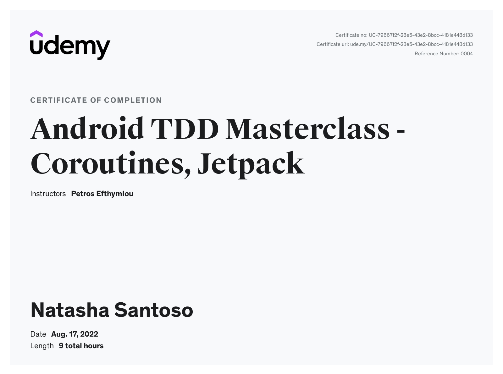
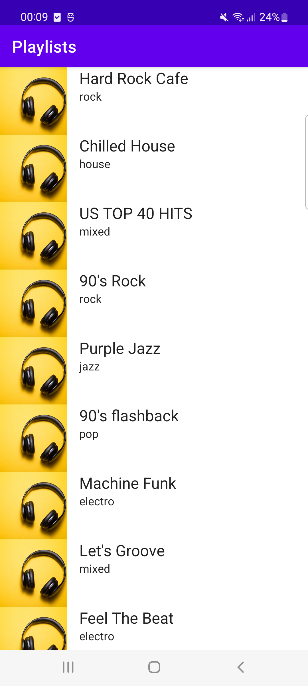

# udemy-android-tdd

## Udemy Master CI/CD for Android Developers
[ALP 22 : Master CI/CD for Android Developers](https://www.udemy.com/course/continuous-integration-and-continuous-delivery-for-android-developers/)  

dev:   
test:   
main:   
---
## Udemy Android TDD Masterclass
[ALP 22 : Android TDD Masterclass - Coroutines, Jetpack](https://www.udemy.com/course/android-11-tdd-masterclass/)

## Requirements
1. As a user, I want to see on the Home Screen a list of my recommended playlists. When I click on a playlist I want to see more details about it.
2. Add a loader
3. Playlists that belong to the rock category should display the Rock image
4. When I click on a playlist, I want to see more details about it.

Don't forget to:
- enable charles proxy on the device, since it is redirected to "http://localhost.charlesproxy.com:3000/"
- turn on Mockoon

## Screenshots

